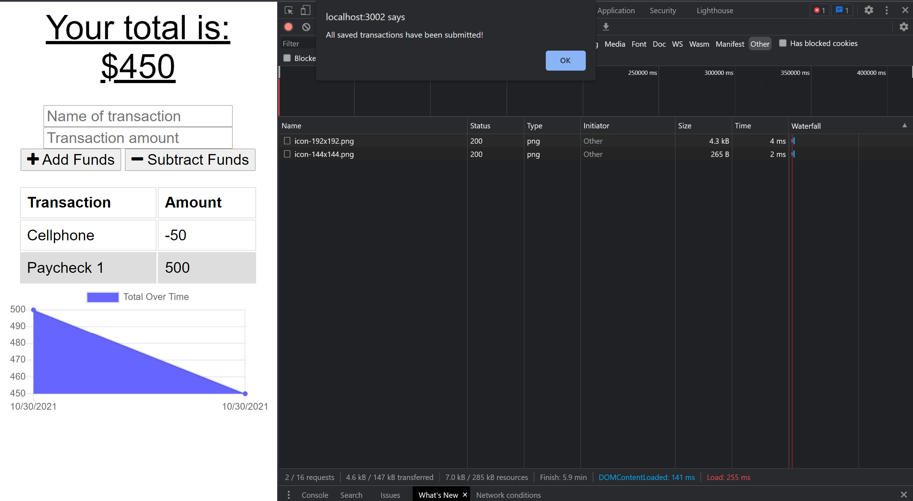

# Budget Tracker
This challenge for Module 19 of the Coding Bootcamp is to  update an existing budget tracker application to allow for offline access and functionality. 

* [Deployed App](#deployedApp)

* [User Story](#userStory)

* [Requirements](#requirements)

* [Technologies Used](#techUsed)

* [What I Learned](#whatILearned)

* [Screenshots](#webImage)

* [Contact Me](#contactMe)

---

## Deployed Budget Tracker

<a href="https://budget-tracker-bjackels5.herokuapp.com/">https://budget-tracker-bjackels5.herokuapp.com/</a>

---

## User Story

* AS AN avid traveler
* I WANT to be able to track my withdrawals and deposits with or without a data/internet connection
* SO THAT my account balance is accurate when I am traveling 

--- 

## Requirements

* When an budget tracker is without internet connections:
    * When the user inputs an expense or deposit, they will receive a notification that they have added that transaction.
    * When the user reesablishes an internet connection, the offline deposits and expenses will be added to the transaction history and their total are updated.
* The project needs a manifest.json that contains the following properties:
    * name
    * short_name
    * icons
    * theme_color
    * background_color
    * start_url
    * display
* The project must be deployed to Heroku using MongoDB Atlas

---

## Technologies Used

* MongoDB
* MongoDB Atlas
* Mongoose
* Chrome Dev Tools
* Heroku
* IndexedDB
* Node.js
* Service Workers

--- 

## What I Learned

### I've learned that while previous modules had a few errors here and there, the Module 19 lesson is a dumpster fire.

* Information I learned in the Module, but we did not apply to the challenge:
    * How to identify performance bottlenecks in web applications.
    * How to explain how performance can be measured in web applications.
    * How to explain the five main categories measured in a Lighthouse audit.
    * How to optimize CSS, JavaScript, and media assets for performance.
    * How to set up webpack in a new front-end project.
    * That the Module has not been updated in a few years, and the latest versions of the technologies used in the lesson do not play well together. This resulted in the students having to figure out if they were doing something wrong (they were not), or if the Module was outdated (it is).
* Lessons I learned and were applied in the challenge:
    * How to use service workers to cache assets for offline functionality.
    * How to convert an existing web application to a PWA.
    * How to use a manifest.json in our projects, and how that will work along with a service worker to make our app a PWA.
    * How to link a manifest to the HTML to let the browser know the app is a PWA.

---

## Budget Tracker Screenshots

All screenshots show the Chrome DevTools

### No Transactions Entered - Online

### One Transaction Entered - Online

### Second Transaction Entered - Offline

### Second Transaction Recorded Once Back Online

---

## Contact Me
You can reach me, Brenda Jackels, at bjackels5@gmail.com.